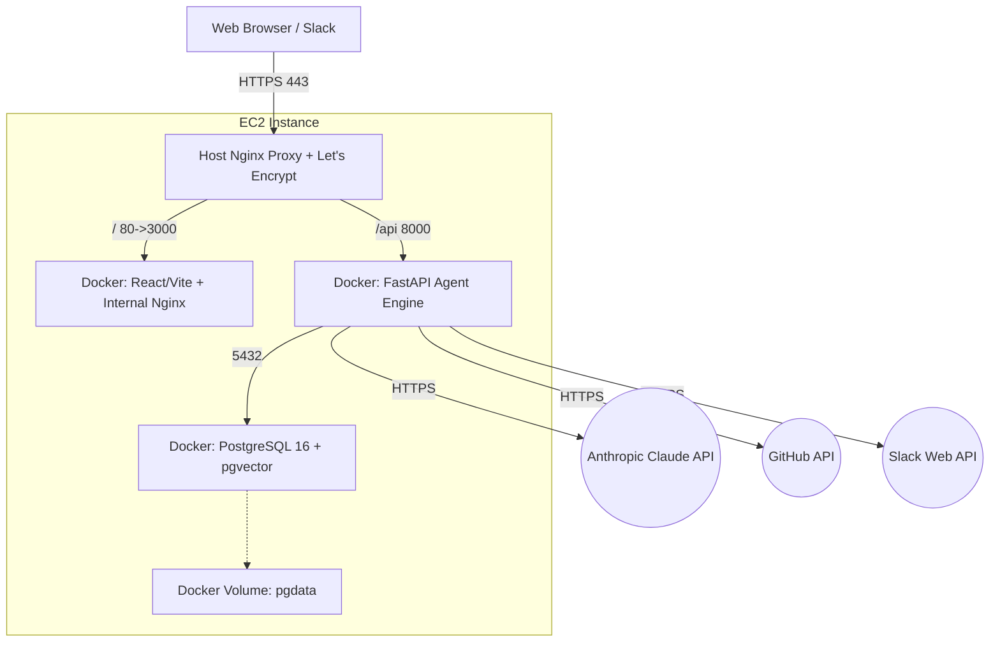

# Smart DevOps Assistant: Production AWS EC2 Deployment Guide

Follow this guide to deploy the Smart DevOps Assistant to an AWS EC2 Instance using Docker Compose and Nginx.

## 1. Launch EC2 Instance
1. Go to your AWS Console and launch a new EC2 instance.
2. Recommended OS: **Ubuntu 22.04 LTS**.
3. Recommended Instance Type: **t3.medium** (requires adequate RAM for the Vector DB, Claude connections, and background agents).

## 2. Security Groups
Configure your EC2 Security Group inbound rules:
- **SSH (22)**: Restrict to your IP address.
- **HTTP (80)**: Open to `0.0.0.0/0`.
- **HTTPS (443)**: Open to `0.0.0.0/0`.

## 3. SSH Access
SSH into your instance:
```bash
ssh -i /path/to/your-key.pem ubuntu@<EC2-PUBLIC-IP>
```

## 4. Clone Repository & Prepare
Once inside the instance:
```bash
git clone https://github.com/spartanabhi/smart-devops-assistant.git
cd smart-devops-assistant
```

## 5. Environment Configuration
Populate the production environment variables:
```bash
cp backend/.env.example backend/.env
nano backend/.env
```
Ensure you provide valid values for `ANTHROPIC_API_KEY`, `GITHUB_TOKEN`, and `SLACK_BOT_TOKEN`.

## 6. Install Dependencies & Docker
Execute the automated setup scripts from the `deployment` folder:
```bash
cd deployment
chmod +x *.sh
./ec2_setup.sh
```

## 7. Docker Compose Commands
Navigate back to the project root and launch the stack:
```bash
cd ..
docker compose build
docker compose up -d
```

### Monitoring Commands
Monitor your production workload using the following Docker commands:
- **List running containers**: `docker ps`
- **View logs**: `docker logs devops_backend -f` (or `devops_frontend`, `devops_postgres`)
- **Restart stack**: `docker compose restart`
- **Tear down stack**: `docker compose down`
- **Start stack**: `docker compose up -d`

## 8. HTTPS Setup & Nginx Reverse Proxy
The Nginx configuration maps `/` to the React frontend container (port 3000) and `/api` to the FastAPI backend container (port 8000).

After your DNS domain (e.g. `aiops.yourdomain.com`) is pointing to the EC2 Public IP, generate the SSL certificate:
```bash
cd deployment
./setup_ssl.sh aiops.yourdomain.com
```

## 9. PostgreSQL Backup & Restore
PostgreSQL data is persistently stored in the `pgdata` Docker volume.
**To Backup:**
```bash
docker exec devops_postgres pg_dump -U devops devopsdb > devopsdb_backup.sql
```
**To Restore:**
```bash
cat devopsdb_backup.sql | docker exec -i devops_postgres psql -U devops -d devopsdb
```

## 10. Troubleshooting
- **Containers failing to start?** Check logs: `docker compose logs -f`
- **PostgreSQL Vector errors?** Ensure the `pgvector/pgvector:pg16` image is running.
- **Slack not responding?** Verify your Slack App settings point to `https://aiops.yourdomain.com/api/slack/actions` for interactivity.

## Architecture Diagram (Production)

