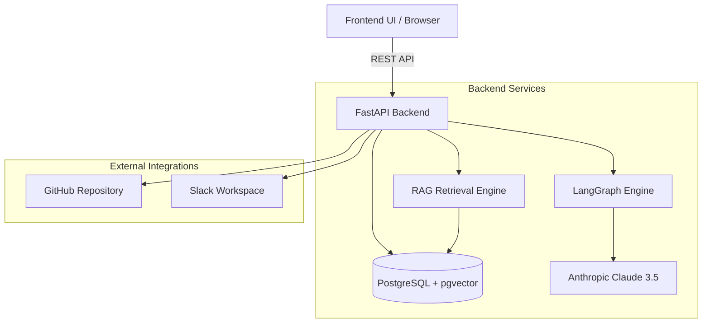
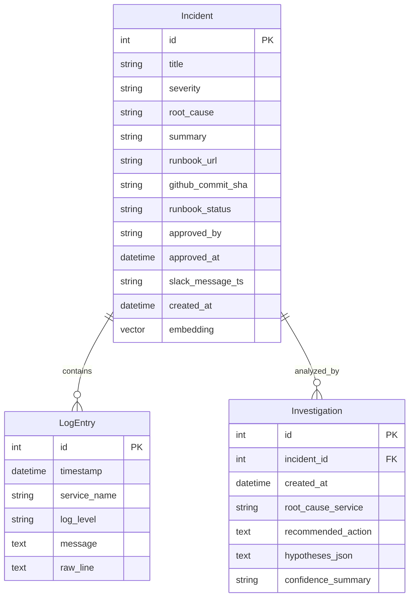
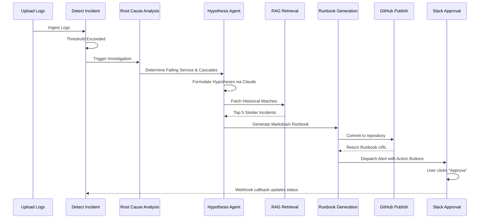
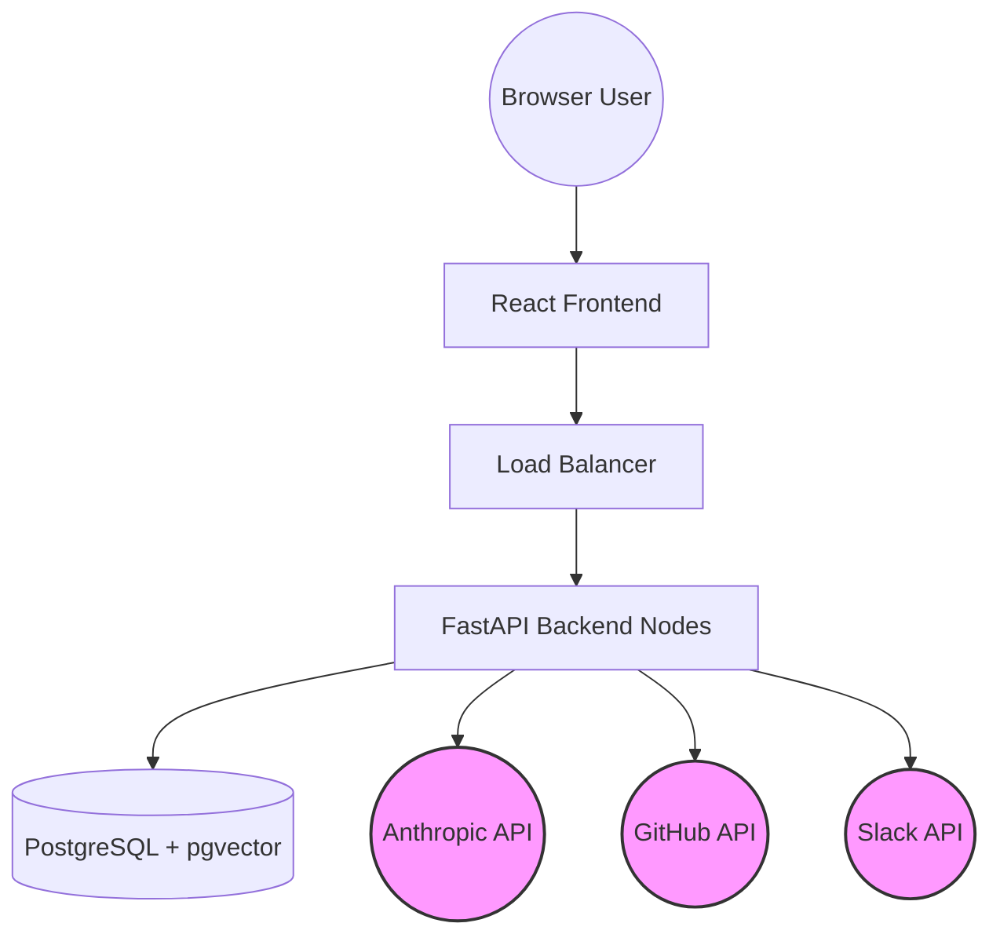

# Smart DevOps Assistant: Diagrams

## 1. Architecture Diagram

```mermaid
graph TD
    Client[Frontend UI / Browser] -->|REST API| API[FastAPI Backend]
    
    subgraph Backend [Backend Services]
        API --> DB[(PostgreSQL + pgvector)]
        API --> AgentEngine[LangGraph Engine]
        AgentEngine --> LLM[Anthropic Claude 3.5]
        API --> RAG[RAG Retrieval Engine]
        RAG --> DB
    end
    
    subgraph Integrations [External Integrations]
        API --> GH[GitHub Repository]
        API --> SL[Slack Workspace]
    end
```

## 2. ER Diagram

```mermaid
erDiagram
    Incident ||--o{ LogEntry : contains
    Incident ||--o{ Investigation : analyzed_by
    
    Incident {
        int id PK
        string title
        string severity
        string root_cause
        string summary
        string runbook_url
        string github_commit_sha
        string runbook_status
        string approved_by
        datetime approved_at
        string slack_message_ts
        datetime created_at
        vector embedding
    }
    
    LogEntry {
        int id PK
        datetime timestamp
        string service_name
        string log_level
        text message
        text raw_line
    }
    
    Investigation {
        int id PK
        int incident_id FK
        datetime created_at
        string root_cause_service
        text recommended_action
        text hypotheses_json
        string confidence_summary
    }
```

## 3. Sequence Diagram

```mermaid
sequenceDiagram
    participant LogStream as Upload Logs
    participant Core as Detect Incident
    participant RCA as Root Cause Analysis
    participant Agent as Hypothesis Agent
    participant RAG as RAG Retrieval
    participant RBGen as Runbook Generation
    participant GH as GitHub Publish
    participant Slack as Slack Approval
    
    LogStream->>Core: Ingest Logs
    Core->>Core: Threshold Exceeded
    Core->>RCA: Trigger Investigation
    RCA->>Agent: Determine Failing Service & Cascades
    Agent->>Agent: Formulate Hypotheses via Claude
    Agent->>RAG: Fetch Historical Matches
    RAG-->>Agent: Top 5 Similar Incidents
    Agent->>RBGen: Generate Markdown Runbook
    RBGen->>GH: Commit to repository
    GH-->>RBGen: Return Runbook URL
    RBGen->>Slack: Dispatch Alert with Action Buttons
    Slack->>Slack: User clicks "Approve"
    Slack-->>Core: Webhook callback updates status
```

## 4. Deployment Diagram

```mermaid
graph TD
    User((Browser User)) --> UI[React Frontend]
    UI --> LB[Load Balancer]
    LB --> FastAPI[FastAPI Backend Nodes]
    
    FastAPI --> PG[(PostgreSQL + pgvector)]
    FastAPI --> Claude((Anthropic API))
    
    FastAPI --> GHApi((GitHub API))
    FastAPI --> SlackApi((Slack API))
    
    classDef external fill:#f9f,stroke:#333,stroke-width:2px;
    class Claude,GHApi,SlackApi external;
```
